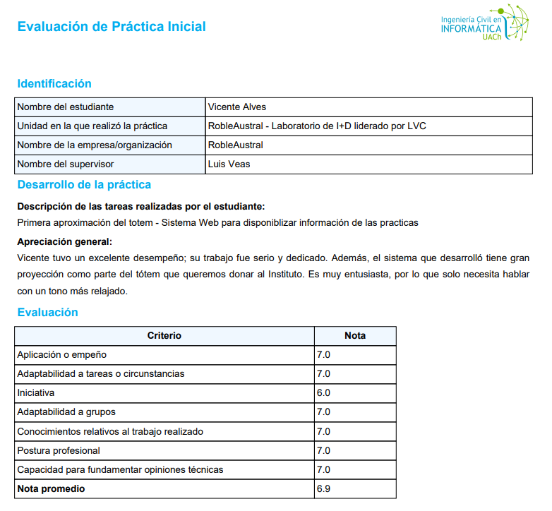

<h1 align="center">Hola, soy Vicente Alves! 👋</h1>

  
Estudiante de Ingeniería Civil en Informática con enfoque en Backend y Análisis de Datos.

  
Apasionado por el desarrollo full stack y la colaboración en equipo.

---

<h3 align="center">Habilidades Clave</h3>

  <table>
    <thead>
      <tr>
        <th>Backend & DB</th>
        <th>Frontend & JS</th>
        <th>Herramientas & Cloud</th>
      </tr>
    </thead>
    <tbody>
      <tr>
        <td>
           
           
          
        </td>
        <td>
           
           
          
        </td>
        <td>
           
           
          
        </td>
      </tr>
      <tr>
        <td>
           
          
        </td>
        <td></td>
        <td>
           
          
        </td>
      </tr>
    </tbody>
  </table>

---

<h3 align="center">Evaluación de Práctica Inicial</h3>

  <table>
    <thead>
      <tr>
        <th>Nota Promedio</th>
        <th>Desempeño</th>
        <th>Tecnologías Clave</th>
      </tr>
    </thead>
    <tbody>
      <tr>
        <td>
          <h2>6.9</h2>
          <!-- Imagen de evaluación justo debajo de la nota -->
          

            
          

        </td>
        <td>
          
Evaluación oficial: <b>Desempeño excelente, con trabajo serio y dedicado.</b>

        </td>
        <td>
          
PostgreSQL, Next.js, Prisma, Apache Airflow

        </td>
      </tr>
    </tbody>
  </table>

---

<h3 align="center">Conecta conmigo</h3>

  
  
  

